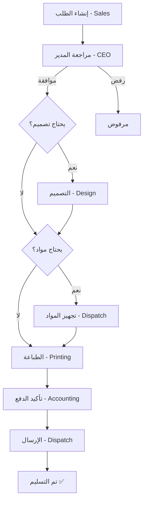

# ملخص المشروع 📊

## 🎯 نظرة عامة

**اسم المشروع**: نظام إدارة شركة نجد  
**النوع**: نظام إدارة داخلي متكامل  
**المنصات**: Web + Mobile (iOS/Android)  
**Backend**: Firebase (Serverless)

## 📦 مكونات المشروع

### 1. تطبيق الويب (Next.js)
- **Framework**: Next.js 14 (App Router)
- **Language**: TypeScript
- **Styling**: Tailwind CSS
- **الصفحات الرئيسية**:
  - تسجيل الدخول
  - لوحة التحكم
  - إدارة الطلبات (عرض، إنشاء، تفاصيل)
  - الإشعارات
  - إدارة المستخدمين (CEO فقط)

### 2. تطبيق الموبايل (React Native + Expo)
- **Framework**: React Native + Expo
- **Language**: TypeScript
- **Navigation**: React Navigation
- **الشاشات الرئيسية**:
  - تسجيل الدخول
  - لوحة التحكم
  - قائمة الطلبات
  - تفاصيل الطلب
  - الإشعارات
  - الملف الشخصي

### 3. Shared Package
- **أنواع مشتركة** (TypeScript Types)
- **ثوابت** (Collections, Paths)
- **وظائف مساعدة** (Labels, Colors)

### 4. Cloud Functions
- **Triggers**:
  - `onOrderCreated` - عند إنشاء طلب
  - `onOrderStatusChanged` - عند تغيير حالة
- **Callable Functions**:
  - `generateOrderNumber` - توليد رقم الطلب
  - `sendNotificationToUser` - إرسال إشعار لمستخدم
  - `sendNotificationToRole` - إرسال إشعار لدور
- **Scheduled Functions**:
  - `cleanupOldNotifications` - تنظيف الإشعارات القديمة

### 5. Firebase Services
- **Authentication**: تسجيل الدخول بالبريد الإلكتروني
- **Firestore**: قاعدة بيانات NoSQL
- **Cloud Storage**: تخزين الملفات
- **Cloud Messaging**: الإشعارات الفورية
- **Hosting**: استضافة تطبيق الويب

## 🔐 الأمان

### Firestore Security Rules
- ✅ التحقق من تسجيل الدخول
- ✅ التحقق من الأدوار
- ✅ صلاحيات القراءة/الكتابة حسب الدور
- ✅ حماية البيانات الحساسة

### Storage Rules
- ✅ التحقق من أنواع الملفات
- ✅ حدود حجم الملفات
- ✅ صلاحيات الوصول

## 👥 الأدوار والصلاحيات

| الدور | القسم | الصلاحيات الرئيسية |
|------|-------|---------------------|
| **CEO** | الإدارة | الوصول الكامل، الموافقة/الرفض |
| **Sales Head** | المبيعات | إنشاء الطلبات، عرض الكل |
| **Sales** | المبيعات | إنشاء الطلبات، عرض طلباته |
| **Design Head** | التصميم | إدارة التصميم، تعيين المهام |
| **Design** | التصميم | استلام طلبات التصميم |
| **Printing Head** | الطباعة | إدارة الطباعة، تعيين المهام |
| **Printing** | الطباعة | استلام طلبات الطباعة |
| **Accounting Head** | الحسابات | إدارة المدفوعات، التقارير |
| **Accounting** | الحسابات | تأكيد المدفوعات |
| **Dispatch Head** | الإرسال | إدارة الإرسال، المواد |
| **Dispatch** | الإرسال | تحديث حالة الإرسال |

## 📊 Workflow الطلبات

## 📈 الإحصائيات

### حجم الكود

| Component | Files | Lines |
|-----------|-------|-------|
| Web App | ~20 | ~2,500 |
| Mobile App | ~15 | ~1,800 |
| Shared Package | ~10 | ~800 |
| Cloud Functions | ~8 | ~600 |
| **Total** | **~53** | **~5,700** |

### المكتبات المستخدمة

#### Production
- `next` (Web Framework)
- `react` & `react-native` (UI)
- `firebase` (Backend)
- `expo` (Mobile Development)
- `@react-navigation` (Mobile Navigation)
- `tailwindcss` (Styling)
- `date-fns` (Date Formatting)

#### Development
- `typescript` (Type Safety)
- `eslint` (Linting)
- `prettier` (Code Formatting) *(قريباً)*

## 🎨 التصميم

### نظام الألوان

| Color | Hex | Usage |
|-------|-----|-------|
| **Najd Blue** | `#0369a1` | Primary Color |
| **Najd Gold** | `#f59e0b` | Accent Color |
| **Success** | `#10b981` | Success States |
| **Warning** | `#f59e0b` | Warning States |
| **Error** | `#ef4444` | Error States |

### Typography
- **Font Family**: Arial, Helvetica (لدعم العربية)
- **RTL Support**: كامل في الويب والموبايل

## 🚀 الأداء

### تطبيق الويب
- ✅ Static Generation حيثما أمكن
- ✅ Code Splitting
- ✅ Image Optimization
- ✅ Font Optimization

### تطبيق الموبايل
- ✅ Native Performance
- ✅ Optimized Images
- ✅ Efficient Re-renders

## 🔄 CI/CD (مستقبلي)

- [ ] GitHub Actions
- [ ] Automated Testing
- [ ] Automated Deployment
- [ ] Code Quality Checks

## 📱 دعم المنصات

### الويب
- ✅ Chrome
- ✅ Safari
- ✅ Firefox
- ✅ Edge
- ✅ Mobile Browsers

### الموبايل
- ✅ iOS 13+
- ✅ Android 6+

## 📊 قاعدة البيانات

### Collections في Firestore

1. **users** - المستخدمين (~10-50 documents)
2. **orders** - الطلبات (~1000+ documents)
3. **notifications** - الإشعارات (~5000+ documents)
4. **counters** - العدادات (1 document)
5. **activity_logs** - سجل النشاطات (~10000+ documents)

### حجم البيانات المتوقع

| Collection | Size per Doc | Total (1000 orders) |
|------------|-------------|---------------------|
| users | ~500 bytes | ~25 KB |
| orders | ~5 KB | ~5 MB |
| notifications | ~300 bytes | ~1.5 MB |
| **Total** | - | **~6.5 MB** |

## 💰 التكلفة المتوقعة (Firebase)

### Spark Plan (مجاني)
- ✅ Authentication: 10K/month
- ✅ Firestore: 1 GB storage, 50K reads/day
- ✅ Storage: 5 GB
- ✅ Hosting: 10 GB/month
- ❌ Functions: محدودة جداً

### Blaze Plan (Pay as you go)
- التكلفة المتوقعة: **$10-50/month** حسب الاستخدام

## 🎯 الميزات المستقبلية

- [ ] تقارير متقدمة
- [ ] تصدير البيانات (Excel, PDF)
- [ ] إشعارات البريد الإلكتروني
- [ ] نظام الأرشفة
- [ ] لوحة تحكم تحليلية
- [ ] دعم اللغة الإنجليزية
- [ ] Dark Mode
- [ ] Offline Support

## 📞 الدعم

للمساعدة أو الأسئلة:
- 📧 Email: support@najd.com
- 📱 Phone: +966-XX-XXX-XXXX
- 🌐 Website: www.najd.com

---

**آخر تحديث**: نوفمبر 2024  
**الإصدار**: 1.0.0  
**الحالة**: ✅ جاهز للإنتاج

© 2024 شركة نجد. جميع الحقوق محفوظة.

